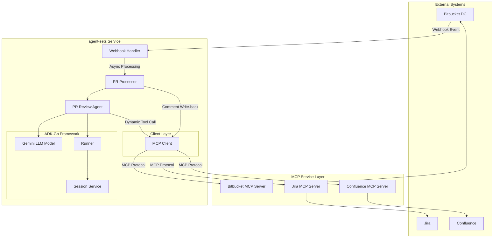
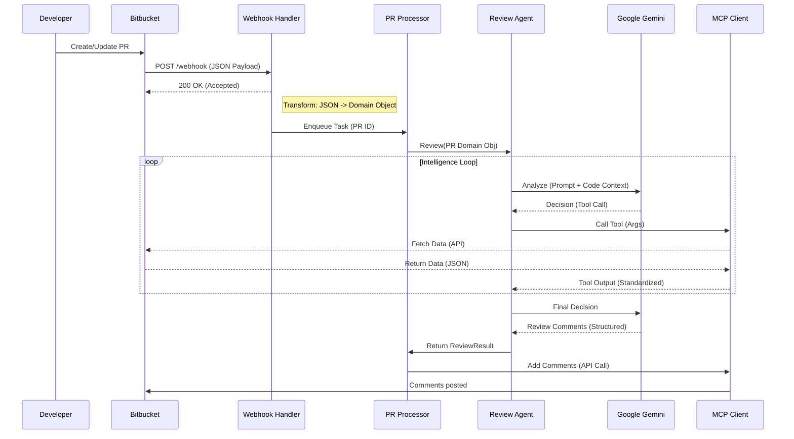

> [中文说明](README.zh.md)

# PR Review Automation with ADK-Go

## Project Overview

This is a **PR Review Automation Tool** (`pr-review-automation`) built on the **Google ADK-Go v0.3.0** framework. It leverages the **Gemini LLM** agent to automatically review Bitbucket Pull Requests, incorporating Jira issue tracking and Confluence documentation for comprehensive assessment.

---

## Tech Stack

| Technology        | Version / Note                                     |
| ----------------- | -------------------------------------------------- |
| **Go**            | 1.25.5                                             |
| **Google ADK-Go** | v0.3.0                                             |
| **Google GenAI**  | v1.42.0                                            |
| **MCP Client**    | github.com/modelcontextprotocol/go-sdk             |
| **LLM Model**     | Gemini 1.5 Flash                                   |
| **Observability** | Prometheus Metrics                                 |
| **Protocols**     | MCP (Model Context Protocol), A2A (Agent-to-Agent) |

---

## Project Structure

```
agent-sets/
├── cmd/
│   └── server/
│       └── main.go              # Service entry point
├── internal/
│   ├── agent/
│   │   └── pr_review_agent.go   # ADK-Go PR Review Agent Core
│   ├── client/
│   │   ├── mcp.go               # MCP Client (Bitbucket/Jira/Confluence)
│   │   └── mcp_test.go          # MCP Client Tests
│   ├── config/
│   │   ├── config.go            # Environment variable configuration loading
│   │   └── config_test.go       # Config tests
│   ├── processor/
│   │   └── pr_processor.go      # PR processing business logic + comment write-back
│   └── webhook/
│       ├── bitbucket.go         # Bitbucket Webhook Handler
│       └── bitbucket_test.go    # Webhook Tests
├── go.mod
├── go.sum
└── README.md
```

---

## Architecture



---

## Workflow

The following sequence diagram illustrates the complete workflow and data flow from Webhook trigger to comment write-back:



---

## Core Modules

### 1. Service Entry (`cmd/server/main.go`)

- Uses `slog` for structured logging.
- Loads environment variable configuration.
- Initializes **MCP Client** (Manages connections for Bitbucket/Jira/Confluence).
- Creates PR Processor and Webhook Handler.
- Starts HTTP service with graceful shutdown support.

---

### 2. Configuration (`internal/config/config.go`)

The tool supports configuration via `config.yaml` (recommended) or environment variables.

#### Configuration File (`config.yaml`)

Each MCP server can be configured with an optional `allowed_tools` whitelist. If omitted or empty, all tools are exposed.

```yaml
mcp:
  bitbucket:
    endpoint: "https://ai.mapscape.cn/bitbucket"
    allowed_tools:
      - bitbucket_get_pull_request
      - bitbucket_add_pull_request_comment
```

#### Environment Variables

| Config Item    | YAML Key                | Environment Variable | Description                 |
| -------------- | ----------------------- | -------------------- | --------------------------- |
| LLM API Key    | `llm.api_key`           | `LLM_API_KEY`        | Gemini API Key              |
| Service Port   | `server.port`           | `PORT`               | Default 8080                |
| Bitbucket MCP  | `mcp.bitbucket.*`       | `BITBUCKET_MCP_*`    | Bitbucket MCP Service/Token |
| Webhook Secret | `server.webhook_secret` | `WEBHOOK_SECRET`     | HMAC Signature Secret       |
| Prompts Dir    | `prompts.dir`           | -                    | Root dir for prompts        |

---

### 3. MCP Client (`internal/client/mcp.go`)

Implemented based on `github.com/modelcontextprotocol/go-sdk`:

- **Tool Filtering**: Supports ADK-Go native `tool.StringPredicate` for whitelisting specific tools.
- **Circuit Breaker**: Automatic protection against failing MCP servers.
- **Dynamic Adaption**: Converts MCP tools into ADK `tool.Tool` instances.
- **Direct Access**: Provides `CallTool` for automated write-back tasks.

---

### 4. PR Review Agent (`internal/agent/pr_review_agent.go`)

**Core AI Component**, based on ADK-Go framework:

- **Dynamic Tool Set**: Uses `mcpClient.GetAllTools` to load MCP tools.
- **Enhanced Prompts**: Guides the Agent to actively call tools to fetch code changes and Jira information.
- **Smart Review**: Agent decides when to query Code, Jira, or Confluence.

#### Review Output Format:

```json
{
  "comments": [
    {
      "file": "filename.ext",
      "line": 123,
      "comment": "Detailed feedback"
    }
  ],
  "score": 85,
  "summary": "Overall assessment summary"
}
```

---

### 5. PR Processor (`internal/processor/pr_processor.go`)

Business Orchestration Layer:

- Receives Webhook → Calls Agent → Gets Results → **Writes Back Comments**
- Parses structured comments from Agent, calls `bitbucket_add_pull_request_comment` to post to Bitbucket
- Supports file-level and line-level comments

#### Comment Output Style

The tool automatically posts two types of comments to the Bitbucket PR:

1.  **Summary Comment**:

    ```markdown
    **AI Review Summary (Model: Gemini 1.5 Flash)**
    Score: 85

    ## Key Findings

    - The overall code structure is good, but exception handling needs improvement.
    - ...
    ```

2.  **Inline Comments**:
    Detailed improvement suggestions or bug warnings for specific lines of code..

---

### 6. Webhook Handler (`internal/webhook/bitbucket.go`)

Handles Webhook events from Bitbucket Data Center:

- **Supported Event Types**: `pr:opened`, `pr:updated`
- **Security Features**:
  - Uses `http.MaxBytesReader` to limit request body size.
  - HMAC-SHA256 signature verification (Optional, enabled via `WEBHOOK_SECRET`).
- **Concurrency Control**: Uses semaphores to limit the number of concurrent processes.
- **Async Processing**: Returns immediately after receiving the request, processing the PR in the background.

---

## Key Features

1. ✅ **Automated PR Review**: Receives Bitbucket Webhooks, uses AI to automatically analyze code changes.
2. ✅ **MCP Tool Integration**: Dynamically loads Bitbucket/Jira/Confluence tools.
3. ✅ **Comment Write-back**: Automatically publishes review results to Bitbucket PRs.
4. ✅ **Code Quality Analysis**: Detects potential bugs, security issues, and performance problems.
5. ✅ **Jira Alignment Verification**: Checks if the PR aligns with relevant Jira issues.
6. ✅ **Concurrency Safety**: Limits concurrent processing to prevent resource exhaustion.
7. ✅ **Graceful Shutdown**: Supports signal-triggered graceful shutdown.

---

## Pending Features

| Feature                | Status    | Description                            |
| ---------------------- | --------- | -------------------------------------- |
| Persistent Storage     | Not Impl. | Storage for review history and metrics |
| More Review Algorithms | Not Impl. | Extensible review rules                |

---

## Deployment

For detailed production deployment instructions (including Webhook configuration, environment variables, and security recommendations), please refer to the [Deployment Guide](docs/deployment.md).

## Quick Start

1. Install dependencies:

   ```bash
   go mod tidy
   ```

2. Configure the tool:

   Create `config.yaml` based on `config.example.yaml`:

   ```yaml
   llm:
     api_key: "your_gemini_api_key"
   mcp:
     bitbucket:
       endpoint: "http://bitbucket-mcp:8080"
       token: "optional_token"
   ```

3. Run the service:

   ```bash
   go run cmd/server/main.go
   ```

4. Run tests:
   ```bash
   go test ./... -v
   ```

### Docker Deployment

1. Build image:

   ```bash
   docker build -t pr-review-automation:latest .
   ```

2. Run container:

   ```bash
   docker run -d \
     -p 8080:8080 \
     -e LLM_API_KEY="your_gemini_api_key" \
     -e BITBUCKET_MCP_ENDPOINT="http://bitbucket-mcp:8080" \
     -e BITBUCKET_MCP_TOKEN="your_token" \
     -e WEBHOOK_SECRET="your_webhook_secret" \
     --name pr-review \
     pr-review-automation:latest
   ```

3. View logs:
   ```bash
   docker logs -f pr-review
   ```

---

## Extending the System

The modular architecture makes the system easy to extend:

1. **Add MCP Services**: Add new Endpoint/Token configurations in `config.go`.
2. **Customize Agent Behavior**: Modify prompt instructions in `pr_review_agent.go`.
3. **Enhance Review Process**: Add new processing stages in `pr_processor.go`.

---

## Summary

- ✅ Clear, modular project structure.
- ✅ Intelligent Agent architecture based on ADK-Go.
- ✅ Dynamic MCP tool integration.
- ✅ Automated review result write-back.
- ✅ Concurrency-safe Webhook handling.
- ✅ Graceful shutdown mechanism.
- ✅ Structured logging.
- ✅ Unit test coverage.
