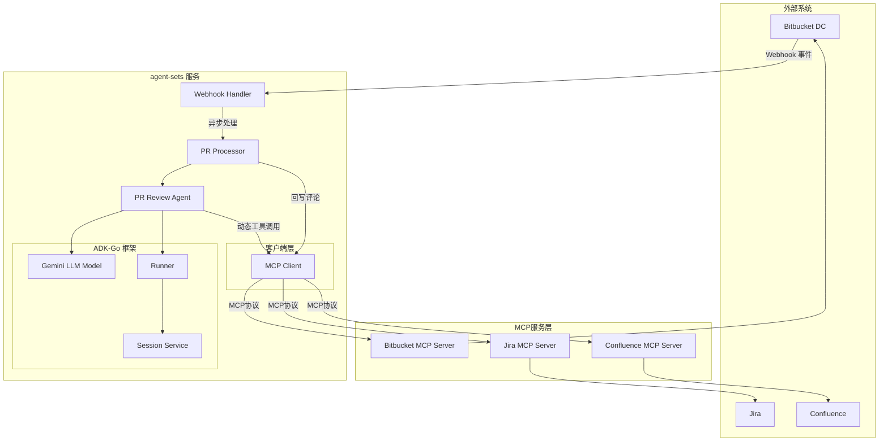

> [Read in English](README.md)

# PR Review Automation with ADK-Go

## 项目概述

这是一个 **PR 自动审核工具**（`pr-review-automation`），基于 **Google ADK-Go v0.3.0** 框架构建，利用 **Gemini LLM** 智能代理自动审核 Bitbucket 的 Pull Request，并能结合 Jira 问题跟踪和 Confluence 文档进行综合评估。

---

## 技术栈

| 技术              | 版本/说明                                          |
| ----------------- | -------------------------------------------------- |
| **Go**            | 1.25.5                                             |
| **Google ADK-Go** | v0.3.0                                             |
| **Google GenAI**  | v1.42.0                                            |
| **MCP Client**    | github.com/modelcontextprotocol/go-sdk             |
| **LLM 模型**      | Gemini 1.5 Flash                                   |
| **协议支持**      | MCP (Model Context Protocol)、A2A (Agent-to-Agent) |

---

## 项目结构

```
agent-sets/
├── cmd/
│   └── server/
│       └── main.go              # 服务入口点
├── internal/
│   ├── agent/
│   │   └── pr_review_agent.go   # ADK-Go PR 审查代理核心
│   ├── client/
│   │   ├── mcp.go               # MCP 客户端 (Bitbucket/Jira/Confluence)
│   │   └── mcp_test.go          # MCP 客户端测试
│   ├── config/
│   │   ├── config.go            # 环境变量配置加载
│   │   └── config_test.go       # 配置测试
│   ├── processor/
│   │   └── pr_processor.go      # PR 处理业务逻辑 + 评论回写
│   └── webhook/
│       ├── bitbucket.go         # Bitbucket Webhook 处理器
│       └── bitbucket_test.go    # Webhook 测试
├── go.mod
├── go.sum
└── README.md
```

---

## 架构图



---

## 核心模块详解

### 1. 服务入口 (`cmd/server/main.go`)

- 使用 `slog` 结构化日志
- 加载环境变量配置
- 初始化 **MCP 客户端**（统一管理 Bitbucket/Jira/Confluence 连接）
- 创建 PR 处理器和 Webhook 处理器
- 启动 HTTP 服务，支持优雅关闭

---

### 2. 配置模块 (`internal/config/config.go`)

工具支持通过 `config.yaml`（推荐）或环境变量进行配置。

#### 配置文件 (`config.yaml`)

每个 MCP 服务器都可以配置可选的 `allowed_tools` 白名单。如果省略或为空，则暴露所有工具。

```yaml
mcp:
  bitbucket:
    endpoint: "https://ai.mapscape.cn/bitbucket"
    allowed_tools:
      - bitbucket_get_pull_request
      - bitbucket_add_pull_request_comment
```

#### 环境变量

| 配置项        | YAML 路径               | 环境变量          | 说明                    |
| ------------- | ----------------------- | ----------------- | ----------------------- |
| LLM API Key   | `llm.api_key`           | `LLM_API_KEY`     | Gemini API 密钥         |
| 服务端口      | `server.port`           | `PORT`            | 默认 8080               |
| Bitbucket MCP | `mcp.bitbucket.*`       | `BITBUCKET_MCP_*` | Bitbucket MCP 服务/令牌 |
| Webhook 签名  | `server.webhook_secret` | `WEBHOOK_SECRET`  | HMAC 签名密钥           |

---

### 3. MCP 客户端 (`internal/client/mcp.go`)

基于 `github.com/modelcontextprotocol/go-sdk` 实现：

- **工具过滤**：支持 ADK-Go 原生的 `tool.StringPredicate`，可配置工具白名单。
- **熔断机制**：对故障的 MCP 服务器进行自动熔断保护。
- **动态适配**：将 MCP 工具动态适配为 ADK `tool.Tool` 接口。
- **直接访问**：提供 `CallTool` 方法供自动化回写任务使用。

---

### 4. PR 审查代理 (`internal/agent/pr_review_agent.go`)

**核心 AI 组件**，基于 ADK-Go 框架：

- **动态工具集**：使用 `mcpClient.GetAllTools` 加载 MCP 工具
- **增强提示词**：引导 Agent 主动调用工具获取代码变更和 Jira 信息
- **智能审查**：Agent 决策何时查询代码、Jira 或 Confluence

#### 审查输出格式：

```json
{
  "comments": [
    {
      "file": "filename.ext",
      "line": 123,
      "comment": "详细反馈"
    }
  ],
  "score": 85,
  "summary": "整体评估摘要"
}
```

---

### 5. PR 处理器 (`internal/processor/pr_processor.go`)

业务编排层：

- 接收 Webhook → 调用 Agent → 获取结果 → **回写评论**
- 解析 Agent 返回的结构化评论，调用 `bitbucket_add_pull_request_comment` 发布到 Bitbucket
- 支持文件级和行级评论

---

### 6. Webhook 处理器 (`internal/webhook/bitbucket.go`)

处理来自 Bitbucket Data Center 的 Webhook 事件：

- **支持事件类型**：`pr:opened`、`pr:updated`
- **安全特性**：
  - 使用 `http.MaxBytesReader` 限制请求体大小
  - HMAC-SHA256 签名验证（可选，通过 `WEBHOOK_SECRET` 启用）
- **并发控制**：使用信号量限制并发处理数量
- **异步处理**：接收请求后立即返回，后台处理 PR

---

## 主要功能

1. ✅ **自动化 PR 审查**：接收 Bitbucket Webhook，使用 AI 自动分析代码变更
2. ✅ **MCP 工具集成**：动态加载 Bitbucket/Jira/Confluence 工具
3. ✅ **评论回写**：将审查结果自动发布到 Bitbucket PR
4. ✅ **代码质量分析**：检测潜在 Bug、安全问题、性能问题
5. ✅ **Jira 对齐验证**：检查 PR 是否与相关 Jira 问题对齐
6. ✅ **并发安全**：限制并发处理数量，防止资源耗尽
7. ✅ **优雅关闭**：支持信号触发的优雅关闭

---

## 待完善功能

| 功能         | 状态   | 说明               |
| ------------ | ------ | ------------------ |
| 持久化存储   | 未实现 | 审查历史和指标存储 |
| 更多审查算法 | 未实现 | 可扩展的审查规则   |

---

## 部署说明

详细的生产环境部署说明（包括 Webhook 配置、环境变量详解及安全建议），请参阅 [部署指南](docs/deployment.zh.md)。

## 快速开始

1. 安装依赖：

   ```bash
   go mod tidy
   ```

2. 配置文件：

   参考 `config.example.yaml` 创建 `config.yaml`：

   ```yaml
   llm:
     api_key: "your_gemini_api_key"
   mcp:
     bitbucket:
       endpoint: "http://bitbucket-mcp:8080"
       token: "optional_token"
   ```

3. 运行服务：

   ```bash
   go run cmd/server/main.go
   ```

4. 运行测试：
   ```bash
   go test ./... -v
   ```

### Docker 部署

1. 构建镜像：

   ```bash
   docker build -t pr-review-automation:latest .
   ```

2. 运行容器：

   ```bash
   docker run -d \
     -p 8080:8080 \
     -e LLM_API_KEY="your_gemini_api_key" \
     -e BITBUCKET_MCP_ENDPOINT="http://bitbucket-mcp:8080" \
     -e BITBUCKET_MCP_TOKEN="your_token" \
     -e WEBHOOK_SECRET="your_webhook_secret" \
     --name pr-review \
     pr-review-automation:latest
   ```

3. 查看日志：
   ```bash
   docker logs -f pr-review
   ```

---

## 扩展系统

模块化架构使系统易于扩展：

1. **添加 MCP 服务**：在 `config.go` 中添加新的 Endpoint/Token 配置
2. **自定义代理行为**：修改 `pr_review_agent.go` 中的指令提示词
3. **增强审查流程**：在 `pr_processor.go` 中添加新的处理阶段

---

## 总结

- ✅ 模块化清晰的项目结构
- ✅ 基于 ADK-Go 的智能代理架构
- ✅ MCP 工具动态集成
- ✅ 审查结果自动回写
- ✅ 并发安全的 Webhook 处理
- ✅ 优雅关闭机制
- ✅ 结构化日志
- ✅ 单元测试覆盖
